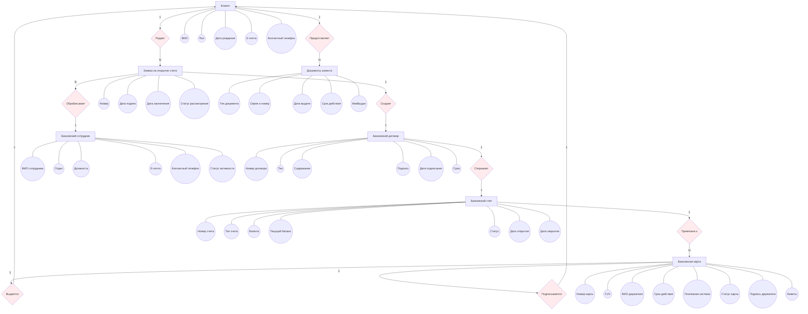

# Концептуальная модель предметной области

```mermaid
graph TD
    %% СУЩНОСТИ
    CLIENT[Клиент]
    APPLICATION[Заявка на открытие счета]
    DOCUMENT[Документы клиента]
    OFFICER[Банковский сотрудник]
    CONTRACT[Банковский договор]
    ACCOUNT[Банковский счет]
    CARD[Банковская карта]
    
    %% СВЯЗИ С КАРДИНАЛЬНОСТЬЮ В РОМБИКАХ
    SUB1{Подает}
    SUB2{Предоставляет}
    SUB3{Обрабатывает}
    SUB4{Создает}
    SUB5{Открывает}
    SUB6{Привязана к}
    SUB7{Выдается}
    SUB8{Подписывается}
    
    %% ОСНОВНЫЕ СВЯЗИ
    CLIENT -- "1" --> SUB1
    SUB1 -- "N" --> APPLICATION
    
    CLIENT -- "1" --> SUB2
    SUB2 -- "N" --> DOCUMENT
    
    APPLICATION -- "N" --> SUB3
    SUB3 -- "1" --> OFFICER
    
    APPLICATION -- "1" --> SUB4
    SUB4 -- "1" --> CONTRACT
    
    CONTRACT -- "1" --> SUB5
    SUB5 -- "1" --> ACCOUNT
    
    ACCOUNT -- "1" --> SUB6
    SUB6 -- "N" --> CARD
    
    CARD -- "1" --> SUB7
    SUB7 -- "1" --> CLIENT
    
    CARD -- "1" --> SUB8
    SUB8 -- "1" --> CLIENT
    
    %% АТРИБУТЫ КЛИЕНТА (в кружочках)
    CLIENT_ATTR1(("ФИО"))
    CLIENT_ATTR2(("Пол"))
    CLIENT_ATTR3(("Дата рождения"))
    CLIENT_ATTR4(("E-почта"))
    CLIENT_ATTR5(("Контактный телефон"))

    CLIENT --- CLIENT_ATTR1
    CLIENT --- CLIENT_ATTR2
    CLIENT --- CLIENT_ATTR3
    CLIENT --- CLIENT_ATTR4
    CLIENT --- CLIENT_ATTR5
    
    %% АТРИБУТЫ ЗАЯВКИ (в кружочках)
    APPLICATION_ATTR1(("Номер"))
    APPLICATION_ATTR2(("Дата подачи"))
    APPLICATION_ATTR3(("Дата заключения"))
    APPLICATION_ATTR4(("Статус рассмотрения"))

    APPLICATION --- APPLICATION_ATTR1
    APPLICATION --- APPLICATION_ATTR2
    APPLICATION --- APPLICATION_ATTR3
    APPLICATION --- APPLICATION_ATTR4
    
    %% АТРИБУТЫ ДОКУМЕНТОВ (в кружочках)
    DOCUMENT_ATTR1(("Тип документа"))
    DOCUMENT_ATTR2(("Серия и номер"))
    DOCUMENT_ATTR3(("Дата выдачи"))
    DOCUMENT_ATTR4(("Срок действия"))
    DOCUMENT_ATTR5(("КемВыдан"))

    DOCUMENT --- DOCUMENT_ATTR1
    DOCUMENT --- DOCUMENT_ATTR2
    DOCUMENT --- DOCUMENT_ATTR3
    DOCUMENT --- DOCUMENT_ATTR4
    DOCUMENT --- DOCUMENT_ATTR5
    
    %% АТРИБУТЫ СОТРУДНИКА (в кружочках)
    OFFICER_ATTR1(("ФИО сотрудника"))
    OFFICER_ATTR2(("Отдел"))
    OFFICER_ATTR3(("Должность"))
    OFFICER_ATTR4(("E-почта"))
    OFFICER_ATTR5(("Контактный телефон"))
    OFFICER_ATTR6(("Статус активности"))

    OFFICER --- OFFICER_ATTR1
    OFFICER --- OFFICER_ATTR2
    OFFICER --- OFFICER_ATTR3
    OFFICER --- OFFICER_ATTR4
    OFFICER --- OFFICER_ATTR5
    OFFICER --- OFFICER_ATTR6
    
    %% АТРИБУТЫ ДОГОВОРА (в кружочках)
    CONTRACT_ATTR1(("Номер договора"))
    CONTRACT_ATTR2(("Тип"))
    CONTRACT_ATTR3(("Содержание"))
    CONTRACT_ATTR4(("Подпись"))
    CONTRACT_ATTR5(("Дата подписания"))
    CONTRACT_ATTR6(("Срок"))

    CONTRACT --- CONTRACT_ATTR1
    CONTRACT --- CONTRACT_ATTR2
    CONTRACT --- CONTRACT_ATTR3
    CONTRACT --- CONTRACT_ATTR4
    CONTRACT --- CONTRACT_ATTR5
    CONTRACT --- CONTRACT_ATTR6
    
    %% АТРИБУТЫ СЧЕТА (в кружочках)
    ACCOUNT_ATTR1(("Номер счета"))
    ACCOUNT_ATTR2(("Тип счета"))
    ACCOUNT_ATTR3(("Валюта"))
    ACCOUNT_ATTR4(("Текущий баланс"))
    ACCOUNT_ATTR5(("Статус"))
    ACCOUNT_ATTR6(("Дата открытия"))
    ACCOUNT_ATTR7(("Дата закрытия"))

    ACCOUNT --- ACCOUNT_ATTR1
    ACCOUNT --- ACCOUNT_ATTR2
    ACCOUNT --- ACCOUNT_ATTR3
    ACCOUNT --- ACCOUNT_ATTR4
    ACCOUNT --- ACCOUNT_ATTR5
    ACCOUNT --- ACCOUNT_ATTR6
    ACCOUNT --- ACCOUNT_ATTR7
    
    %% АТРИБУТЫ КАРТЫ (в кружочках)
    CARD_ATTR1(("Номер карты"))
    CARD_ATTR2(("CVV"))
    CARD_ATTR3(("ФИО держателя"))
    CARD_ATTR4(("Срок действия"))
    CARD_ATTR5(("Платежная система"))
    CARD_ATTR6(("Статус карты"))
    CARD_ATTR7(("Подпись держателя"))
    CARD_ATTR8(("Лимиты"))

    CARD --- CARD_ATTR1
    CARD --- CARD_ATTR2
    CARD --- CARD_ATTR3
    CARD --- CARD_ATTR4
    CARD --- CARD_ATTR5
    CARD --- CARD_ATTR6
    CARD --- CARD_ATTR7
    CARD --- CARD_ATTR8
    
    %% СТИЛИ ДЛЯ РОМБИКОВ
    style SUB1 fill:#ffebee
    style SUB2 fill:#ffebee
    style SUB3 fill:#ffebee
    style SUB4 fill:#ffebee
    style SUB5 fill:#ffebee
    style SUB6 fill:#ffebee
    style SUB7 fill:#ffebee
    style SUB8 fill:#ffebee
```
